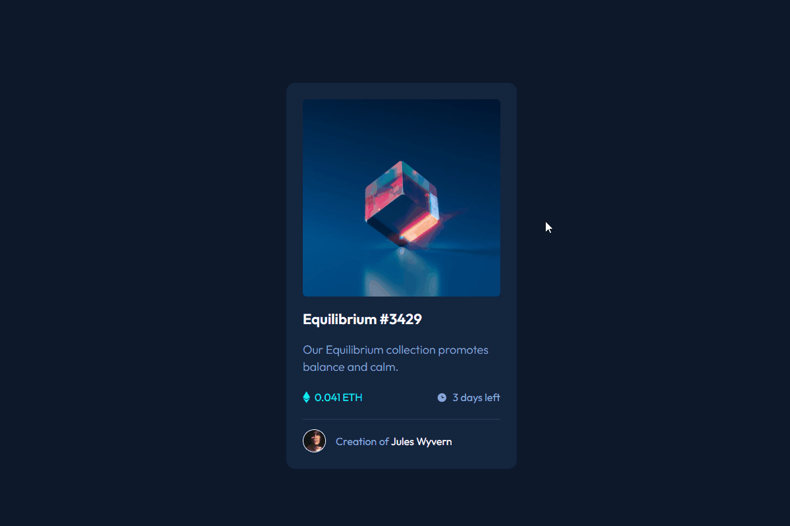

# <h1 align="center">Frontend Mentor  - Solução de componente de cartão de visualização NFT</h1>

Esta é uma solução para o [desafio do componente de cartão de visualização NFT no Frontend Mentor](https://www.frontendmentor.io/challenges/nft-preview-card-component-SbdUL_w0U). 

##  Indice

* [Visão geral](#visão-geral)
    * [O desafio](#o-desafio)
    * [Captura de tela](#captura-de-tela)
- [Processo](#processo)
    - [Construído com](#construído-com)
    - [O que eu aprendi](#o-que-eu-aprendi)
    - [Acesso a Página](#acesso-a-página)
    - [Autora](#autora)
---

## <p align="center">Visão Geral</p>

### O desafio

Os usuários devem ser capazes de:

- Ver o layout ideal dependente do tamanho da tela do dispositivo;
- Ver os estados de interação dos elementos.

---

### Captura de tela



---

## <p align="center">Processo</p>

### Construído com

- Propriedades personalizadas de CSS
- Variáveis no CSS para manuseio das cores
- Flexbox
- Responsivo para dispositivos móveis

---

### O que eu aprendi


- Melhor Entendimento do uso do FlexBox;
  ```css
  main{
    display: flex;
    justify-content: center;
    align-items: center;
    height: 100vh;
    padding: 0 15px;}

- Uso na prática e entendimento das variáveis do CSS;

  ```css
  .nft-card .info .days-left{
    color: var(--primary-soft);
    display: flex;
    font-weight: 400; }

- Aplicação de pseudo-elementos para estilização;
  ```css
   .nft-card .info .days-left::before{
    content: '';
    width: 15px;
    display: inline-block;
    margin-right: 9px;}

- Uso do background na adição de imagens;

  ```css
  .nft-card .info .price::before{
    background: url(../images/icon-ethereum.svg) no-repeat center;}
    
---

### Acesso a Página

- [GitHub Page](https://carolinapalma.github.io/nft-card-frontendmentor/)

---

### <p align="center">Autora</p>

Carolina Palma

- [Linkedin](https://www.linkedin.com/in/carolina-palma-medeiros/) 

- [Github](https://github.com/Carolinapalma)

